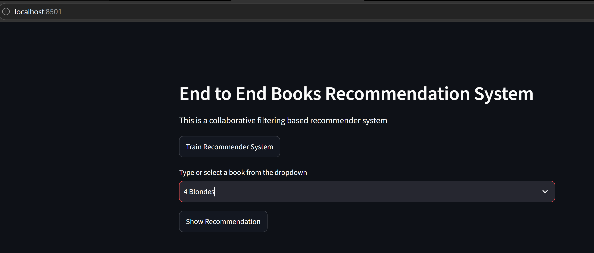

# 📚 Book Recommendation System

A machine learning-powered Book Recommendation System built using **Python**, **Scikit-Learn**, and **Streamlit**. The application recommends books similar to the user's selection using a collaborative filtering approach and presents the recommendations through an interactive web interface.

---

## 🚀 Features

- Recommend books similar to the selected title
- Interactive Streamlit web application
- Machine Learning-based recommendation engine
- Clean and modular project structure
- Docker support for easy deployment
- Ready for cloud deployment (Render/AWS)

---

## 🛠️ Tech Stack

- Python
- Pandas
- NumPy
- Scikit-Learn
- Streamlit
- Pickle
- Docker

---

## 📂 Project Structure

```text
Book-Recommender/
│
├── Books_recommendor/        # Source code
├── artifacts/                # Processed datasets & trained model
├── config/                   # Configuration files
├── notebook/                 # Research & experimentation
├── app.py                    # Streamlit application
├── Dockerfile
├── requirements.txt
├── setup.py
├── README.md
├── LICENSE
└── .gitignore
```

---

## ⚙️ Installation

### Clone the repository

```bash
git clone https://github.com/shantanuchapke400-crypto/book-recommendation-system.git

cd book-recommendation-system
```

### Create a virtual environment

```bash
python -m venv venv
```

### Activate the environment

**Windows**

```bash
venv\Scripts\activate
```

**Linux / macOS**

```bash
source venv/bin/activate
```

### Install dependencies

```bash
pip install -r requirements.txt
```

---

## ▶️ Run the Application

```bash
streamlit run app.py
```

Open your browser:

```
http://localhost:8501
```

---

## 🐳 Run with Docker

Build the Docker image

```bash
docker build -t book-recommender .
```

Run the container

```bash
docker run -p 8501:8501 book-recommender
```

---

## 🧠 How It Works

1. User selects a book.
2. The recommendation engine searches for similar books.
3. Top recommendations are retrieved using the trained similarity model.
4. Recommended books and their cover images are displayed in the Streamlit interface.

---

## 📸 Screenshots

### 🏠 Home Page

The main interface where users can train the recommendation model, select a book from the dropdown, and generate personalized recommendations.



### 📖 Recommendation Results

Example of the recommendation engine displaying books similar to the selected title along with their cover images.


---

## 🔮 Future Improvements

- User authentication
- Hybrid recommendation system
- Personalized recommendations
- Book ratings and reviews
- Advanced search & filtering
- REST API using FastAPI/Flask
- CI/CD pipeline
- Cloud deployment

---

## 📜 License

This project is licensed under the **MIT License**.

---

## 👨‍💻 Author

**Shantanu Chapke**

📧 Email: shantanuchapke400@gmail.com

🐙 GitHub: https://github.com/shantanuchapke400-crypto

💼 LinkedIn: https://www.linkedin.com/in/shantanu-chapke-38038a375
---

⭐ If you found this project helpful, consider giving it a star on GitHub!